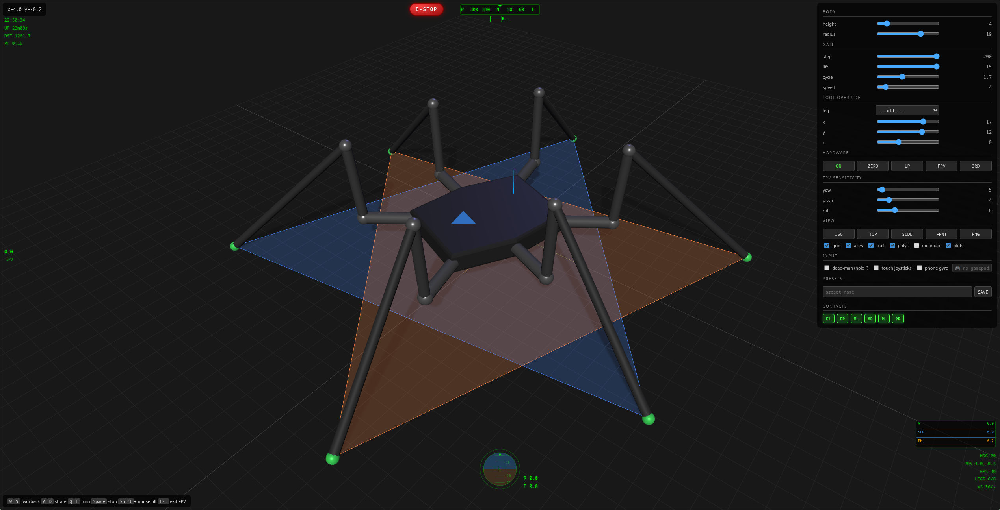
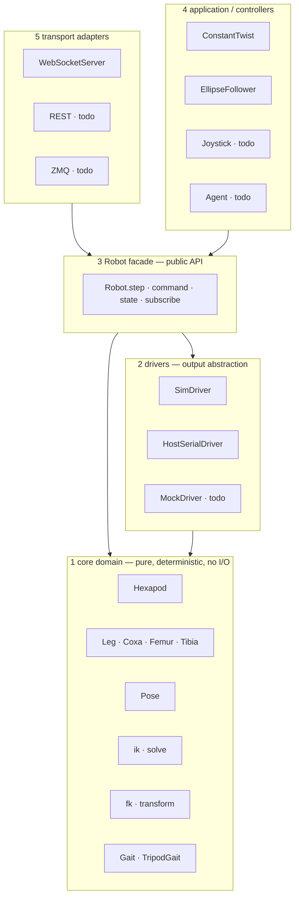
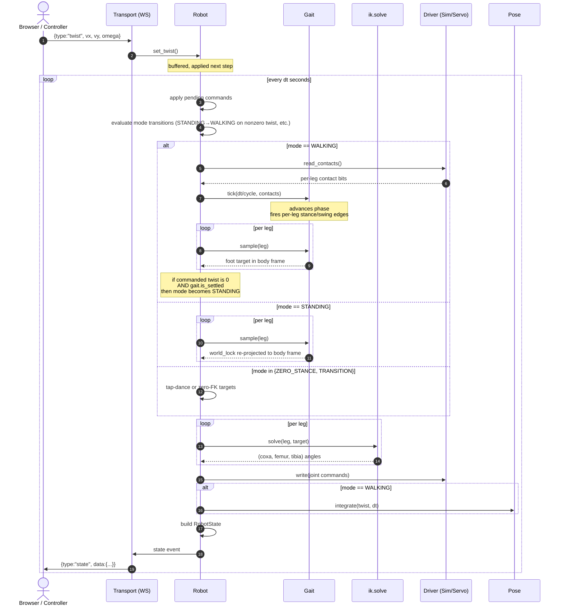
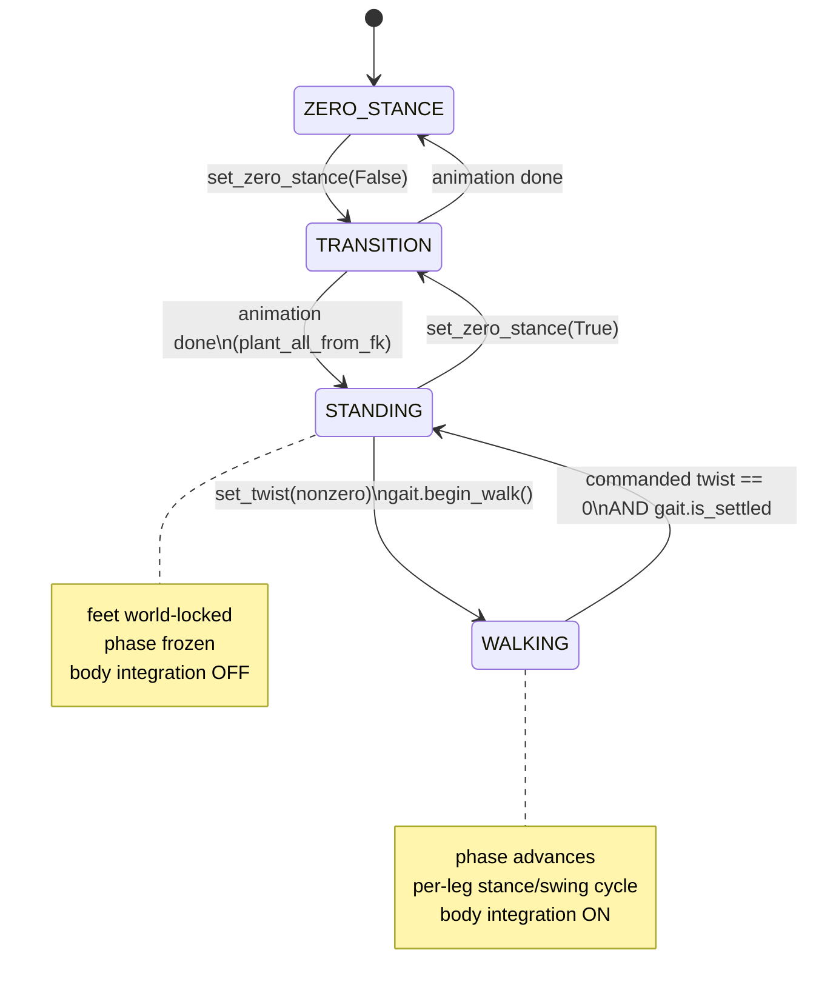
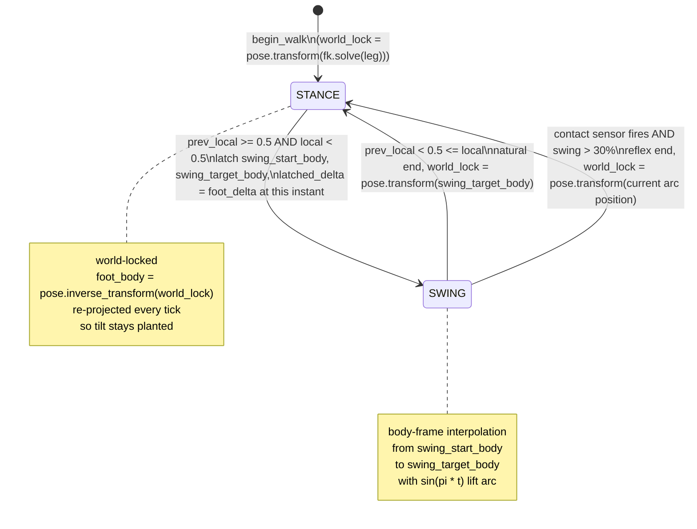
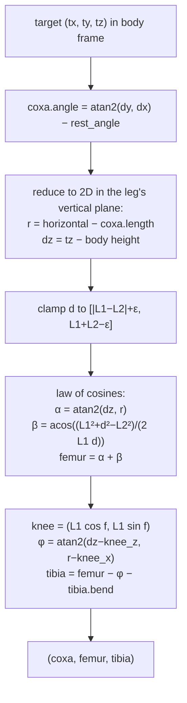
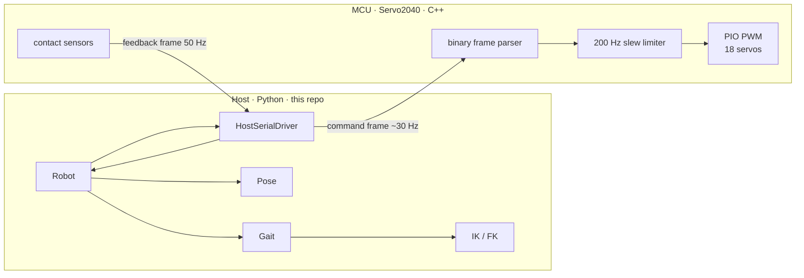

# inverse_kinematics_hexapod



Real-time hexapod simulator and control stack. Pure-Python core (kinematics,
gait, pose), a clean public API, and a Svelte + three.js frontend talking to
a Python WebSocket server. The hardware path drives a Pimoroni Servo2040 over USB
serial via custom C++ firmware in `firmware/servo2040/`.

> **Hardware reference**: this codebase is built around the 3D-printed
> hexapod from rob's tech workbench tutorials —
> <https://github.com/robs-tech-workbench/hexapod_spiderbot_tutorials> and the
> [`hexapod_spiderbot_mod`](https://github.com/robs-tech-workbench/hexapod_spiderbot_mod)
> body. Joint lengths in `config/hexapod.yaml` (coxa 5 cm / femur 8 cm /
> tibia 18 cm with 25° bend) are bearing-to-bearing distances measured on
> that build with DS3235SSG 270° servos. The kinematic core is independent
> of mechanical design — point it at any 3-DOF / 6-leg hexapod by changing
> `config/hexapod.yaml` and the per-servo calibration table.

---

## Highlights

- **3-DOF leg kinematics** — analytical IK with reachability clamping, FK chained
  per joint. Six legs, two tripod groups.
- **Tripod gait** with terrain-adaptive **early touchdown** via per-leg ground
  contact sensors.
- **Body pose decoupled from feet** — stance feet are world-locked; the body
  only translates when at least one leg is committed to a planned step. No
  sliding when starting/stopping.
- **Layered architecture** — core math, drivers, robot facade, controllers,
  transports, viz are all swappable. The same `Robot` drives a sim, a
  matplotlib viewer, the browser frontend, or a Pimoroni Servo2040 over USB.
- **Svelte + three.js frontend (v2)** — orbit / chase / FPV cameras, drone-style
  HUD (attitude, compass, minimap, sparklines), battery gauge, gamepad and
  touch joystick support, sliders for height / step / stance radius / lift /
  cycle time, WSAD/QE keyboard control, per-leg manual foot-target override,
  live contact strip from the firmware feedback frame, optional MJPEG camera
  stream. Served by `server.py` itself over HTTP; discoverable on the LAN
  via mDNS (`hexapod.local`).
- **Real hardware path is built** — `HostSerialDriver` speaks a binary frame
  protocol to a Pimoroni Servo2040, with per-servo calibration tables, a
  firmware-side slew limiter, watchdog, and auto-reconnect on the host.
- **Bent-tibia support** — kinematic length plus a `bend` constant per joint,
  so STL parts whose foot pivot doesn't lie on the femur extension still
  work without re-meshing.

---

## Architecture

Five layers. Each only depends on the layers below it.



**Rules**

- `core/` is pure. No I/O, no time, no async, no print. Pure functions and
  plain data. Determinism is the contract — feed it the same inputs, you get
  the same outputs.
- `Robot` is the **only** thing the outside world should depend on. It owns
  the core + a driver, exposes commands (`set_twist`, `set_body_height`, …),
  state (`RobotState` DTO), and the per-tick `step(dt)` loop.
- Drivers, controllers, transports, viz are all interchangeable. None of them
  know about each other.

---

## Module layout

```
src/hexapod/
├─ __init__.py            re-exports Hexapod, Robot, core types
├─ robot.py               Robot facade — the public API surface
├─ core/                  pure domain
│  ├─ enums.py            Segment, Side
│  ├─ angle.py            Angle (rad / deg, single source of truth)
│  ├─ pose.py             body pose: x, y, yaw, transform, inverse_transform
│  ├─ hexapod.py          Hexapod — height, pose, six Legs
│  ├─ legs.py             Legs container (segment/side indexing)
│  ├─ leg/
│  │  ├─ leg.py           Leg with back-ref to Hexapod
│  │  ├─ coxa.py          mount, length, angle, world_angle, start, end
│  │  ├─ femur.py         length, angle, start, end
│  │  └─ tibia.py         length, angle, bend, start, end
│  ├─ kinematics/
│  │  ├─ fk/              forward kinematics — joint angles → world point
│  │  │  ├─ coxa.py       coxa_end = mount + L_coxa·(cos,sin) of world_angle
│  │  │  ├─ femur.py      femur_end above coxa.end at femur.angle
│  │  │  └─ tibia.py      foot from femur with relative tibia.angle
│  │  └─ ik/              inverse kinematics — target point → joint angles
│  │     └─ __init__.py   solve() with reachability clamp, knee-up branch
│  ├─ gait/
│  │  ├─ base.py          Gait state machine; world-locked stance; reflex
│  │  └─ tripod.py        TripodGait — two alternating triangles
│  └─ config.py           YAML loader (symmetric mount expansion)
├─ api/
│  └─ dto.py              RobotState · PoseDTO · TwistDTO · LegState
├─ drivers/
│  ├─ base.py             JointDriver Protocol
│  ├─ sim.py              SimDriver — no-op driver, kept for tests
│  ├─ serial.py           HostSerialDriver — USB serial to Servo2040
│  └─ servo/
│     ├─ profile.py       ServoProfile — linear angle→pulse fallback
│     ├─ calibration.py   per-servo measured tables, piecewise-linear interp
│     ├─ mapping.py       JointServo, ServoMap — channel routing + lookup
│     └─ protocol.py      binary frame format (canonical wire spec)
├─ controllers/
│  ├─ base.py             Controller Protocol
│  └─ twist.py            ConstantTwist
├─ transports/
│  └─ websocket.py        bidirectional JSON over websockets
└─ viz/
   └─ matplotlib.py       MatplotlibViz + run loop (a Robot consumer)

config/hexapod.yaml             body geometry, mounts, servo channel map
config/servos/<profile>.yaml    servo electrical/mechanical envelope
config/calibration/<name>.yaml  per-servo measured angle→pulse tables
firmware/servo2040/             C++ firmware for the Pimoroni Servo2040
frontend_v2/                    Svelte + Vite + three.js client (bun build)
frontend/                       legacy v1 client (CDN, no build step)
server.py                       WS + static HTTP + mDNS; --device for hardware
main.py                         entry point for the matplotlib viz path
scripts/hold_zero.py            hold every servo at calibrated centre
tests/                          86 tests · pytest, no hardware required
```

---

## Reference frames


- **World frame** — fixed in space. Browser renders here. The body trail lives here.
- **Body frame** — origin at the body's geometric centre, +x forward, +y left,
  +z up. Travels and rotates with the body.
- **Leg local frame** — implicit. Each coxa has a `mount` (body-frame xy) and a
  `rest_angle = atan2(my, mx)` pointing outward from the body centre. The leg's
  joint angles are offsets from this rest direction.

The split is enforced everywhere:

- IK and FK operate **only** in the body frame. They never see the world pose.
- The gait writes targets in body frame. Stance feet are kept world-stationary
  by re-deriving their body-frame coordinates each tick from a locked
  `world_lock` point: `foot_body = pose.inverse_transform(world_lock)`.
- Visualization is the **only** place that converts body → world for display.

This is the property that lets the same core code drive both a sim *and* a
real robot moving through space.

---

## Data flow per tick



The two key decoupling points:

- `read_contacts()` runs *before* `gait.tick()`, so the gait can reflex on
  ground contact within the same tick.
- `pose.integrate` runs **only** when `mode == WALKING`. Every other mode
  holds the body still — this is what stops the body from sliding ahead of
  feet that haven't lifted yet (and from drifting after a stop while legs
  finish their last swings).

---

## State machines

The walking system is two explicit state machines, one nested inside the other.

### Robot mode



`begin_walk()` snapshots every leg's actual FK position into `world_lock` —
so the first STANCE→SWING transition reads truth, not a stale cache. This
is what makes walk-start visually smooth.

### Per-leg phase (inside WALKING)

Each leg runs its own state machine as the gait phase cycles. The state is
keyed by phase but can be *forced* by ground contact.



Why this shape:

- **Invariant: `phase == STANCE ⇒ world_lock is not None`.** There is no
  fallback to "neutral" on missing lock — the source of the old walk-start
  twitch — because the lock is always set explicitly on entering STANCE.
- **Latching at swing-start** prevents teleports when twist changes mid-cycle.
  A leg in swing finishes its planned arc using the delta it latched; the
  *next* swing-start picks up the new command.
- **Locking the world position at swing-end** is what makes stance feet stay
  planted as the body rolls over them — even if the user changes speed during
  the stance.
- **Reflex touchdown** locks at the foot's *current* arc position, not the
  planned landing target, so the foot doesn't drag through the obstacle that
  triggered the contact sensor.

---

## Inverse kinematics

3-DOF analytical, knee-up branch only:



`ik.solve` never throws on out-of-reach inputs. If the target is outside the
femur+tibia annulus, it's projected onto the nearest reachable point along the
same direction; the leg fully extends or folds toward the requested location.
`Robot.step` adds a second safety net: any unexpected solver failure falls
back to the leg's previous angles, so a single bad target can't strand the
loop.

---

## Public API surface

This is the contract any external system (frontend, MCU, planner, AI agent,
test harness) should depend on. **Do not reach into `core/` or `gait/` from
outside `Robot`.**

### `Robot` — `src/hexapod/robot.py`

Construction:
```python
hexapod = Hexapod.from_config("config/hexapod.yaml")
gait    = TripodGait(hexapod, step_length=4, lift_height=3)
robot   = Robot(hexapod, gait, SimDriver(hexapod), cycle_seconds=0.6)
```

Commands (buffered ones are applied at the start of the next `step`):
```python
robot.set_twist(vx, vy, omega)        # body-frame velocity, units/sec, rad/sec
robot.set_foot_target(leg_key, xyz)   # one-shot per-leg override
robot.set_body_pose(x, y, yaw)        # teleport (buffered; feet re-anchor at new pose)
robot.set_body_height(z)              # body height above ground (feet stay planted)
robot.set_body_orientation(roll, pitch)  # body tilt (feet stay world-planted)
robot.set_step_length(L)              # soft cap on per-cycle translation
robot.set_stance_radius(r)            # how far feet sit from coxa mounts
robot.set_lift_height(h)              # swing-arc lift height
robot.set_cycle_time(seconds)         # duration of one full gait cycle
robot.set_zero_stance(enabled)        # tap-dance to/from zero-FK rest pose
robot.set_servos_enabled(enabled)     # toggle servo output (sim is unaffected)
robot.stop()                          # zero twist; robot settles to STANDING
```

Mode is exposed as `robot.mode` (a `RobotMode` enum). External code should
treat it as read-only.

Tick:
```python
state = robot.step(dt)                # advance dt seconds, return RobotState
```

State out:
```python
state = robot.state()                 # current snapshot, no advance
unsub = robot.subscribe(callback)     # called on every step
```

### `RobotState` DTO — `src/hexapod/api/dto.py`

```python
RobotState(
    t: float,
    pose: PoseDTO(x, y, z, yaw, roll, pitch),
    twist: TwistDTO(vx, vy, omega),
    legs: dict[str, LegState],   # "front_left" -> LegState
    gait_phase: float,
)

LegState(
    angles: JointAngles(coxa, femur, tibia),
    coxa_start, coxa_end, femur_end, foot,   # body frame, all four joint points
    contact: bool,                            # ground contact sensor
)
```

`RobotState.to_dict()` and `RobotState.from_dict()` give you JSON serialization
for free. The wire format used by the WebSocket transport is exactly this.

---

## Quick start

```bash
uv sync
```

### Matplotlib viewer (no browser)
```bash
uv run python main.py
```

### Browser frontend (v2), simulator
```bash
# one-time build of the Svelte frontend
cd frontend_v2 && bun install && bun run build && cd ..

# server — one process serves WebSocket, static frontend, and mDNS
uv sync --extra mdns
uv run python server.py
```

Open <http://hexapod.local:8080/> from any device on the LAN. If mDNS isn't
working, use the host's IP instead (`http://<host-ip>:8080/`). If only `frontend/`
is present and `frontend_v2/dist/` isn't, the server falls back to v1 at the
same URL.

### Browser frontend, real hardware
```bash
uv sync --extra hardware --extra mdns
uv run python server.py --device /dev/ttyACM0
```

Press `W`/`A`/`S`/`D`/`Q`/`E` to drive, `Space` to stop, hold `` ` `` as a
dead-man while using a gamepad. Drag the right-hand sliders to adjust
geometry live. The **foot target** dropdown lets you pick a leg and command
its foot directly via X/Y/Z sliders — handy for verifying IK or calibrating
mechanical zeros. The HUD shows attitude, compass, minimap trail, speed
sparklines, and battery.

### Server options
```bash
uv run python server.py --help
# --device /dev/ttyACM0   real hardware instead of simulator
# --host 0.0.0.0          bind address (default 0.0.0.0, LAN-visible)
# --port 8765             WebSocket port
# --static-port 8080      HTTP port for the frontend
# --static-dir <path>     override the served directory
# --no-static             disable the built-in HTTP server
# --mdns-name hexapod     reach the frontend at <name>.local
# --no-mdns               disable mDNS advertisement
# --no-camera             disable the MJPEG webcam stream
```

### Tests

```bash
uv run pytest        # 86 tests, no hardware needed
```

---

## Configuration

### `config/hexapod.yaml`

Body is symmetric, so each segment's mount defines `(x, y)` for the **left**
side and the right is mirrored. Joint dimensions are bearing-to-bearing
distances. `tibia.bend` is a fixed mechanical offset (in degrees) between
the line "femur extended straight" and "tibia bearing axis → foot tip" —
lets a physically bent STL part still be modelled as a straight kinematic
segment of the chord length:

```yaml
height: 12.0

coxa:  { length: 5.0,  angle: 0.0 }
femur: { length: 8.0,  angle: 0.0 }
tibia: { length: 18.0, angle: 0.0, bend: 25.0 }

mounts:
  front: [6.0, 6.0]
  mid:   [0.0, 5.0]
  rear:  [-6.0, 4.0]
```

A **`servos:`** section declares which channel on the Servo2040 each joint
is wired to, plus optional `inverted: true` (servo turns the opposite way to
the kinematic convention) and `trim_deg: <float>` (mechanical zero offset
applied before the calibration lookup):

```yaml
servos:
  profile: ds3235ssg
  legs:
    front_right:
      coxa:  { channel: 0 }
      femur: { channel: 1, inverted: true }
      tibia: { channel: 2, inverted: true }
    front_left:
      coxa:  { channel: 3, inverted: true }
      femur: { channel: 4 }
      tibia: { channel: 5 }
    # …mid and rear similarly
```

### `config/servos/<profile>.yaml`

Per-servo-model envelope. Linear angle→pulse map fallback used when no
calibration is available. `max_speed_dps` is informational on the host but
the firmware slew limiter derives its rate from it:

```yaml
name: ds3235ssg
frequency_hz: 50
pulse_min_us: 500
pulse_max_us: 2500
angle_min_deg: -135
angle_max_deg: 135
max_speed_dps: 460
```

### `config/calibration/<profile>.yaml`

Per-physical-servo measured `(deg → pulse_us)` table, taken across the full
mechanical travel. The host interpolates piecewise-linearly. This captures
each individual servo's mechanical zero offset AND the slight nonlinearity
at the ends of the travel that a single linear slope misses. Loaded
automatically by `ServoMap.from_config` if it exists at
`<config_dir>/calibration/<profile>.yaml`; pass `calibration=False` to
disable.

```yaml
servo: ds3235ssg
zero_offset_deg: 135        # IK angle 0 ↔ this row in the table
legs:
  front_right:
    coxa:
      - {deg:   0, pulse_us:  470}
      - {deg:  45, pulse_us:  780}
      - {deg:  90, pulse_us: 1080}
      - {deg: 135, pulse_us: 1360}
      - {deg: 180, pulse_us: 1695}
      - {deg: 225, pulse_us: 2000}
      - {deg: 270, pulse_us: 2330}
    femur: [...]
    tibia: [...]
  # ... five more legs
```

---

## Extending the system

### Add a new gait
Subclass `Gait`, set `GROUPS`. The base class handles latching, world-locking,
contact reflexes, and twist→delta math. Wave gait would be six groups of one
leg, ripple gait three groups of two.

```python
class WaveGait(Gait):
    GROUPS = [
        {(Segment.FRONT, Side.RIGHT)},
        {(Segment.MID,   Side.RIGHT)},
        ...
    ]
```

### Add a new controller
Implement the `Controller` protocol — `update(robot, state, dt)`. Read state,
call `robot.set_twist(...)`. The `viz/matplotlib.run` loop and any future
transport loop will drive it for you.

### Add a new driver
Implement the `JointDriver` protocol — `write(commands)`,
`read_contacts() -> dict[LegKey, bool] | None`, `close()`. Drop it into
`drivers/`. The same `Robot` consumes it.

### Add a new transport
Make a class that owns its own loop, instantiates a `Robot`, parses incoming
messages → `robot.set_*()`, encodes `robot.state().to_dict()` → outgoing
messages. The `WebSocketServer` in `transports/websocket.py` is the reference
example (~100 lines).

---

## Hardware path



The whole hardware path is built. Only the driver swaps:

```python
# server.py picks based on the --device flag
driver = HostSerialDriver(servo_map, device="/dev/ttyACM0")
robot  = Robot(hexapod, gait, driver, cycle_seconds=0.6)
```

### Wire protocol

Defined in `src/hexapod/drivers/servo/protocol.py` — the canonical reference
that the firmware mirrors.

| Direction | Bytes | Layout |
|---|---|---|
| Host → MCU (command) | 38 | `0xA5 \| 18 × uint16 LE pulse_us \| XOR` |
| MCU → Host (feedback) | 3 | `0x5A \| contact_bits \| XOR` |

Contact bit ordering (LSB first): `front_left`, `front_right`, `mid_left`,
`mid_right`, `rear_left`, `rear_right`.

### Host (`src/hexapod/drivers/serial.py`)

- Implements the `JointDriver` protocol — drop-in for `SimDriver`.
- Lazy-imports `pyserial` (optional `[hardware]` extra) so the simulator
  path doesn't require it.
- Per-frame: looks up each joint's channel + calibration, applies trim and
  inversion, interpolates the calibration table, packs all 18 pulses, sends
  one command frame.
- **Resilient**: on `OSError` (transient USB hiccup, MCU reboot, kernel EIO)
  it logs once, closes the port, and retries opening every 2 s. The robot
  loop never crashes on a serial glitch.

### Firmware (`firmware/servo2040/`)

C++, built against pico-sdk + pimoroni-pico. See `firmware/servo2040/README.md`
for toolchain install and build/flash instructions.

- Receives command frames over USB CDC, validates the XOR checksum, decodes
  the 18 pulse widths into a `target_pulse[]` table.
- 200 Hz inner loop walks `current_pulse[]` toward `target_pulse[]` at a
  rate derived from the servo profile's `max_speed_dps` (≈3407 µs/s for
  the DS3235SSG). Result: continuous host trajectories pass through
  unchanged; abrupt host commands get smoothed.
- 50 Hz feedback frame with contact bits read live from the 6 `SENSOR_1..6`
  inputs via the analog mux. Pull-downs are configured at boot, so an open
  input reads ~0 V and a switch shorting to 3.3 V drives it high; threshold
  is 1.0 V. Sensor → leg-bit mapping (matching `CONTACT_ORDER` in
  `protocol.py`):
  `SENSOR_1` → front_left, `SENSOR_2` → front_right, `SENSOR_3` → mid_left,
  `SENSOR_4` → mid_right, `SENSOR_5` → rear_left, `SENSOR_6` → rear_right.
- Watchdog: 500 ms without a valid command frame disables the cluster.
  (Note: on Pimoroni's `ServoCluster`, `disable_all()` does NOT actually
  drop the PWM line; the servos hold the last latched position. This is
  acknowledged in the source.)

---

## What's done · what's planned

**Done**

- Pure Python core (kinematics, gait, pose) with no I/O
- Analytical IK with reachability clamp + safety net
- Tibia bend support (rigid mechanical offset baked into FK and IK)
- Tripod gait with world-locked stance and explicit per-leg state machine
- Robot-level mode state machine (`ZERO_STANCE` / `TRANSITION` / `STANDING` /
  `WALKING`) with FK-snapshot on walk-start (no teleport)
- Workspace-aware default `neutral_radius` for asymmetric leg geometries
- Body pose decoupled from feet (no slide bug)
- Tunable cycle time, step length cap, body height, stance radius
- Contact sensor plumbed end to end (`SimDriver` synthesizes from foot z)
- Early-touchdown reflex (terminate swing on contact, lock world position
  at the actual contact point — *not* the planned ground-level landing)
- Matplotlib viz + Svelte/three.js browser viz, both consumers of the same `Robot`
- WebSocket transport, JSON wire format = `RobotState.to_dict()`
- Built-in static HTTP server + mDNS advertisement — one `server.py` process
  serves the WebSocket, the frontend bundle, and an optional MJPEG camera
  stream; discoverable on the LAN at `hexapod.local:8080`
- Live UI: WSAD/QE control, gamepad, touch joystick, drone-style HUD
  (attitude, compass, minimap, sparklines, battery), orbit / chase / FPV
  cameras, sliders for height/step/radius/lift/cycle, contact-coloured feet,
  support triangles, body trail
- **Manual foot-target override** in the UI: pick a leg, drag X/Y/Z sliders,
  the gait yields control of that leg until you switch back to "off"
- **Real hardware path**: `HostSerialDriver` + Servo2040 C++ firmware,
  binary frame protocol, 200 Hz firmware-side slew limiter, watchdog,
  host-side auto-reconnect on USB failure
- **Per-servo calibration**: YAML measurement tables, piecewise-linear
  interpolation, pulled in automatically by `ServoMap.from_config`
- **85-test suite** covering pose, IK·FK round-trip (incl. with bend),
  gait invariants, DTO round-trip, calibration interpolation, wire
  protocol round-trip, driver resilience

**Next**

- Late-touchdown extension (probe down until contact)
- Coordinated phase pause (halt other tripod when one reflex extends a swing)
- Coordinated phase pause (when reflex extends one swing, the other tripod
  should stop advancing instead of marching on)
- Body roll/pitch from leg load distribution
- IMU integration (host outer loop, MCU inner loop)
- Reverse-engineer a real fail-safe for the Servo2040 watchdog
  (Pimoroni's `disable_all()` doesn't actually drop the PWM line)
