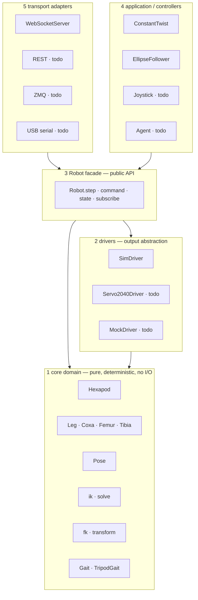
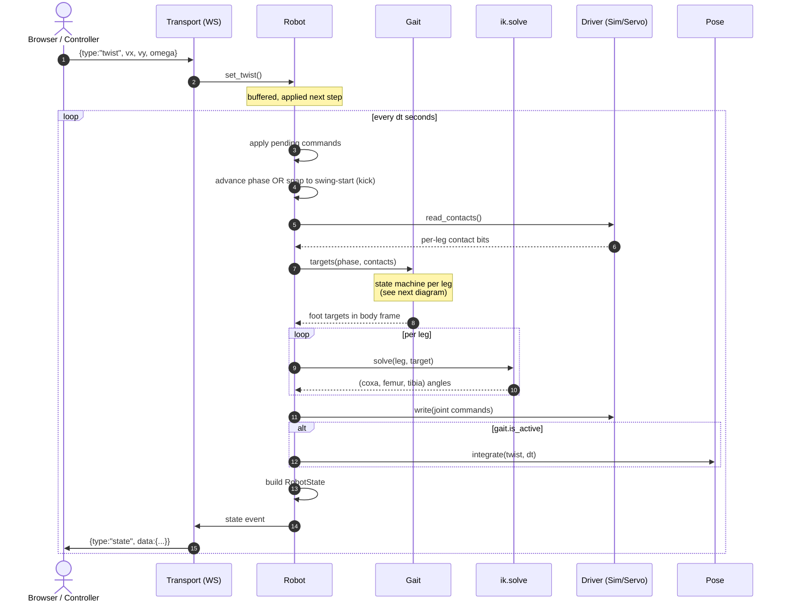
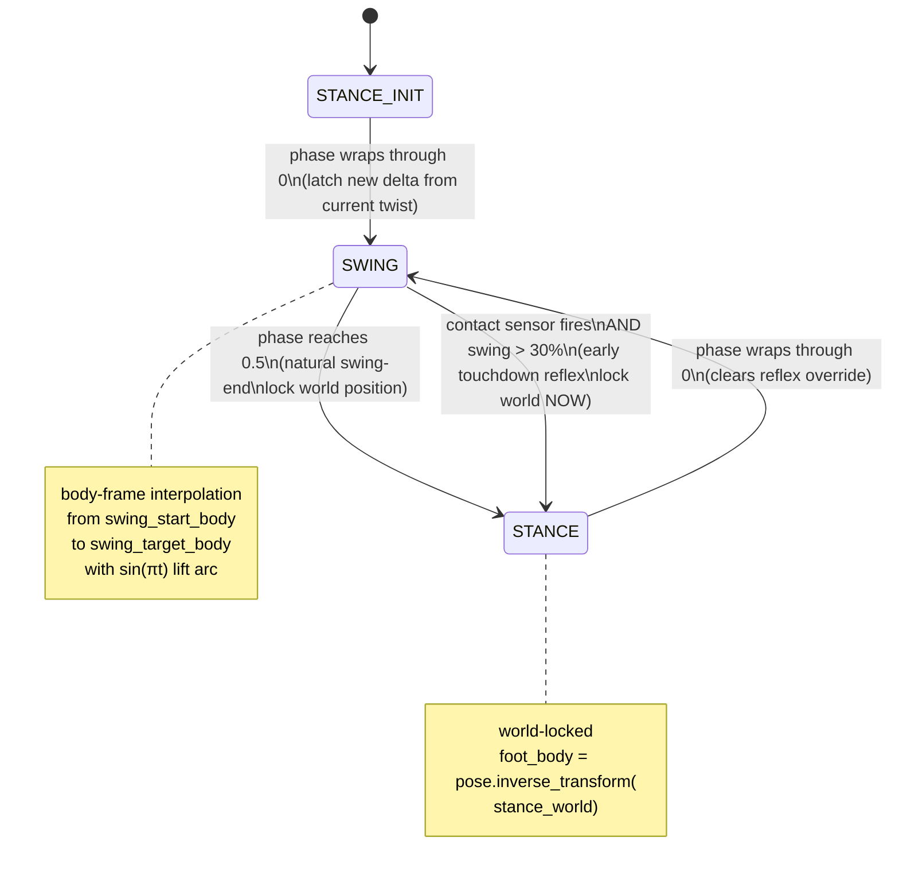
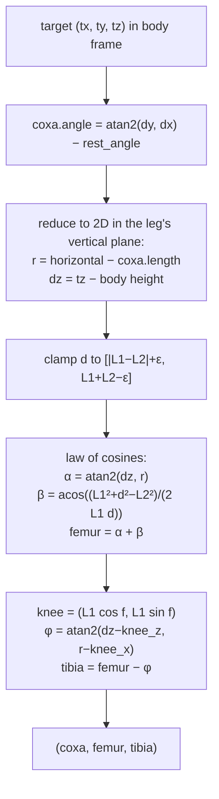
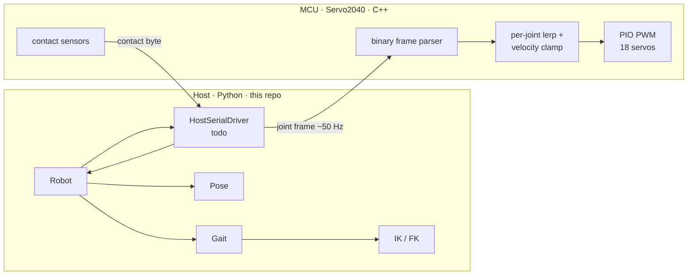

# inverse_kinematics_hexapod

Real-time hexapod simulator and control stack. Pure-Python core (kinematics,
gait, pose), a clean public API, and a three.js frontend talking to a Python
WebSocket server. Designed so the math layer can be ported to a microcontroller
later without touching anything else.

---

## Highlights

- **3-DOF leg kinematics** — analytical IK with reachability clamping, FK chained
  per joint. Six legs, two tripod groups.
- **Tripod gait** with terrain-adaptive **early touchdown** via per-leg ground
  contact sensors.
- **Body pose decoupled from feet** — stance feet are world-locked; the body
  only translates when at least one leg is committed to a planned step. No
  sliding when starting/stopping.
- **Layered architecture** — core math, drivers, robot facade, controllers,
  transports, viz are all swappable. The same `Robot` drives a sim, a
  matplotlib viewer, a three.js browser, or (planned) a Servo2040 over USB.
- **Live three.js frontend** — orbit camera, jointed leg rendering, support
  triangles, body trail, contact-coloured feet, sliders for height / step /
  stance radius, WSAD/QE keyboard control.

---

## Architecture

Five layers. Each only depends on the layers below it.



**Rules**

- `core/` is pure. No I/O, no time, no async, no print. Pure functions and
  plain data. Determinism is the contract — feed it the same inputs, you get
  the same outputs.
- `Robot` is the **only** thing the outside world should depend on. It owns
  the core + a driver, exposes commands (`set_twist`, `set_body_height`, …),
  state (`RobotState` DTO), and the per-tick `step(dt)` loop.
- Drivers, controllers, transports, viz are all interchangeable. None of them
  know about each other.

---

## Module layout

```
src/hexapod/
├─ __init__.py            re-exports Hexapod, Robot, core types
├─ robot.py               Robot facade — the public API surface
├─ core/                  pure domain
│  ├─ enums.py            Segment, Side
│  ├─ angle.py            Angle (rad / deg, single source of truth)
│  ├─ pose.py             body pose: x, y, yaw, transform, inverse_transform
│  ├─ hexapod.py          Hexapod — height, pose, six Legs
│  ├─ legs.py             Legs container (segment/side indexing)
│  ├─ leg/
│  │  ├─ leg.py           Leg with back-ref to Hexapod
│  │  ├─ coxa.py          mount, length, angle, world_angle, start, end
│  │  ├─ femur.py         length, angle, start, end
│  │  └─ tibia.py         length, angle, start, end
│  ├─ kinematics/
│  │  ├─ fk/              forward kinematics — joint angles → world point
│  │  │  ├─ coxa.py       coxa_end = mount + L_coxa·(cos,sin) of world_angle
│  │  │  ├─ femur.py      femur_end above coxa.end at femur.angle
│  │  │  └─ tibia.py      foot from femur with relative tibia.angle
│  │  └─ ik/              inverse kinematics — target point → joint angles
│  │     └─ __init__.py   solve() with reachability clamp, knee-up branch
│  ├─ gait/
│  │  ├─ base.py          Gait state machine; world-locked stance; reflex
│  │  └─ tripod.py        TripodGait — two alternating triangles
│  └─ config.py           YAML loader (symmetric mount expansion)
├─ api/
│  └─ dto.py              RobotState · PoseDTO · TwistDTO · LegState
├─ drivers/
│  ├─ base.py             JointDriver Protocol
│  └─ sim.py              SimDriver — writes into in-memory Hexapod
├─ controllers/
│  ├─ base.py             Controller Protocol
│  └─ twist.py            ConstantTwist
├─ transports/
│  └─ websocket.py        bidirectional JSON over websockets
└─ viz/
   └─ matplotlib.py       MatplotlibViz + run loop (a Robot consumer)

config/hexapod.yaml       body geometry — symmetric mounts, joint defaults
frontend/index.html       three.js client (CDN, no build step)
server.py                 entry point: build core, wrap in Robot, run WS server
main.py                   entry point for the matplotlib viz path
```

---

## Reference frames


- **World frame** — fixed in space. Browser renders here. The body trail lives here.
- **Body frame** — origin at the body's geometric centre, +x forward, +y left,
  +z up. Travels and rotates with the body.
- **Leg local frame** — implicit. Each coxa has a `mount` (body-frame xy) and a
  `rest_angle = atan2(my, mx)` pointing outward from the body centre. The leg's
  joint angles are offsets from this rest direction.

The split is enforced everywhere:

- IK and FK operate **only** in the body frame. They never see the world pose.
- The gait writes targets in body frame. Stance feet are kept world-stationary
  by re-deriving their body-frame coordinates each tick from a locked
  `stance_world` point: `foot_body = pose.inverse_transform(stance_world)`.
- Visualization is the **only** place that converts body → world for display.

This is the property that lets the same core code drive both a sim *and* a
real robot moving through space.

---

## Data flow per tick



The two key decoupling points:

- `read_contacts()` runs *before* `gait.targets`, so the gait can reflex on
  ground contact within the same tick.
- `pose.integrate` runs **only** if `gait.is_active`. If no leg has latched a
  non-zero plan, the body sits still — this is what stops the body from
  sliding ahead of feet that haven't lifted yet.

---

## Per-leg gait state machine

Each leg goes through swing → stance → swing repeatedly. The state is keyed
by phase but can be *forced* by ground contact.



Why this shape:

- **Latching at swing-start** prevents teleports when twist changes mid-cycle.
  A leg in swing finishes its planned arc; the *next* swing picks up the new
  command.
- **Locking the world position at swing-end** is the part that makes stance
  feet stay planted as the body rolls over them — even if the user changes
  speed during the stance.
- **Reflex override** is a separate flag that lets contact sensors short-circuit
  the swing→stance transition without confusing the natural phase tracking.
  It's cleared on the next *real* phase-driven swing-start.

---

## Inverse kinematics

3-DOF analytical, knee-up branch only:



`ik.solve` never throws on out-of-reach inputs. If the target is outside the
femur+tibia annulus, it's projected onto the nearest reachable point along the
same direction; the leg fully extends or folds toward the requested location.
`Robot.step` adds a second safety net: any unexpected solver failure falls
back to the leg's previous angles, so a single bad target can't strand the
loop.

---

## Public API surface

This is the contract any external system (frontend, MCU, planner, AI agent,
test harness) should depend on. **Do not reach into `core/` or `gait/` from
outside `Robot`.**

### `Robot` — `src/hexapod/robot.py`

Construction:
```python
hexapod = Hexapod.from_config("config/hexapod.yaml")
gait    = TripodGait(hexapod, step_length=4, lift_height=3)
robot   = Robot(hexapod, gait, SimDriver(hexapod), cycle_seconds=0.6)
```

Commands (all buffered, applied at the start of the next `step`):
```python
robot.set_twist(vx, vy, omega)        # body-frame velocity, units/sec, rad/sec
robot.set_foot_target(leg_key, xyz)   # one-shot per-leg override
robot.set_body_pose(x, y, yaw)        # teleport (bypasses dynamics)
robot.set_body_height(z)              # body height above ground
robot.set_step_length(L)              # soft cap on per-cycle translation
robot.set_stance_radius(r)            # how far feet sit from coxa mounts
robot.stop()                          # zero twist
```

Tick:
```python
state = robot.step(dt)                # advance dt seconds, return RobotState
```

State out:
```python
state = robot.state()                 # current snapshot, no advance
unsub = robot.subscribe(callback)     # called on every step
```

### `RobotState` DTO — `src/hexapod/api/dto.py`

```python
RobotState(
    t: float,
    pose: PoseDTO(x, y, z, yaw, roll, pitch),
    twist: TwistDTO(vx, vy, omega),
    legs: dict[str, LegState],   # "front_left" -> LegState
    gait_phase: float,
)

LegState(
    angles: JointAngles(coxa, femur, tibia),
    coxa_start, coxa_end, femur_end, foot,   # body frame, all four joint points
    contact: bool,                            # ground contact sensor
)
```

`RobotState.to_dict()` and `RobotState.from_dict()` give you JSON serialization
for free. The wire format used by the WebSocket transport is exactly this.

---

## Quick start

```bash
uv sync
```

### Matplotlib viewer (no browser)
```bash
uv run python main.py
```

### Browser frontend (recommended)
```bash
# terminal 1 — simulation server
uv run python server.py

# terminal 2 — static files (so the WS in the page can connect)
python -m http.server -d frontend 8080
```
Open <http://127.0.0.1:8080/>. Press `W`/`A`/`S`/`D`/`Q`/`E` to drive, `Space`
to stop. Drag the right-hand sliders to adjust geometry live.

---

## Configuration

`config/hexapod.yaml` — body is symmetric, so each segment defines `(x, y)`
for the **left** side and the right is mirrored:

```yaml
height: 5.0

coxa:  { length: 5.0,  angle: 0.0 }
femur: { length: 8.0,  angle: 0.0 }
tibia: { length: 12.0, angle: 0.0 }

mounts:
  front: [6.0, 4.0]
  mid:   [0.0, 5.0]
  rear:  [-6.0, 4.0]
```

The loader (`core/config.py`) expands these into six per-leg dicts and sign-flips
the right side's joint defaults to keep symmetry.

---

## Extending the system

### Add a new gait
Subclass `Gait`, set `GROUPS`. The base class handles latching, world-locking,
contact reflexes, and twist→delta math. Wave gait would be six groups of one
leg, ripple gait three groups of two.

```python
class WaveGait(Gait):
    GROUPS = [
        {(Segment.FRONT, Side.RIGHT)},
        {(Segment.MID,   Side.RIGHT)},
        ...
    ]
```

### Add a new controller
Implement the `Controller` protocol — `update(robot, state, dt)`. Read state,
call `robot.set_twist(...)`. The `viz/matplotlib.run` loop and any future
transport loop will drive it for you.

### Add a new driver
Implement the `JointDriver` protocol — `write(commands)`,
`read_contacts() -> dict[LegKey, bool] | None`, `close()`. Drop it into
`drivers/`. The same `Robot` consumes it.

### Add a new transport
Make a class that owns its own loop, instantiates a `Robot`, parses incoming
messages → `robot.set_*()`, encodes `robot.state().to_dict()` → outgoing
messages. The `WebSocketServer` in `transports/websocket.py` is the reference
example (~100 lines).

---

## Hardware path (planned)



The key insight: **the only thing that changes when hardware lands is the
driver**. The gait, IK, pose math, controllers, transports, viz all stay
identical. The MCU is dumb on purpose — the gait runs on the host, the MCU
just smooths the joint stream and reports contact bits.

Recommended split:

- **Host (Python)** runs at 50–100 Hz, computes IK and gait, sends 18 ×
  uint16 servo microseconds in a packed binary frame.
- **MCU (C++)** runs a 200 Hz loop, linearly interpolates between successive
  host targets with a per-joint angular-velocity clamp, generates PWM via PIO,
  reads contact sensors, sends a 1-byte feedback frame (6 bits, one per leg).
- **Watchdog**: if no host packet for 500 ms, MCU commands all joints to a
  known safe stand pose.

---

## What's done · what's planned

**Done**

- Pure Python core (kinematics, gait, pose) with no I/O
- Analytical IK with reachability clamp + safety net
- Tripod gait with world-locked stance + idle/stop handling
- Body pose decoupled from feet (no slide bug)
- Tunable cycle time, step length cap, body height, stance radius
- Idle→active "kick" — instant response to twist commands
- Contact sensor plumbed end to end (`SimDriver` synthesizes from foot z)
- Early-touchdown reflex (terminate swing on contact)
- Matplotlib viz + three.js browser viz, both consumers of the same `Robot`
- WebSocket transport, JSON wire format = `RobotState.to_dict()`
- Live UI: WSAD/QE control, sliders for height/step/radius, contact-coloured feet,
  support triangles, body trail

**Next**

- Late-touchdown extension (probe down until contact)
- Coordinated phase pause (halt other tripod when one reflex extends a swing)
- `HostSerialDriver` + Servo2040 C++ skeleton
- Body roll/pitch from leg load distribution
- IMU integration (host outer loop, MCU inner loop)
